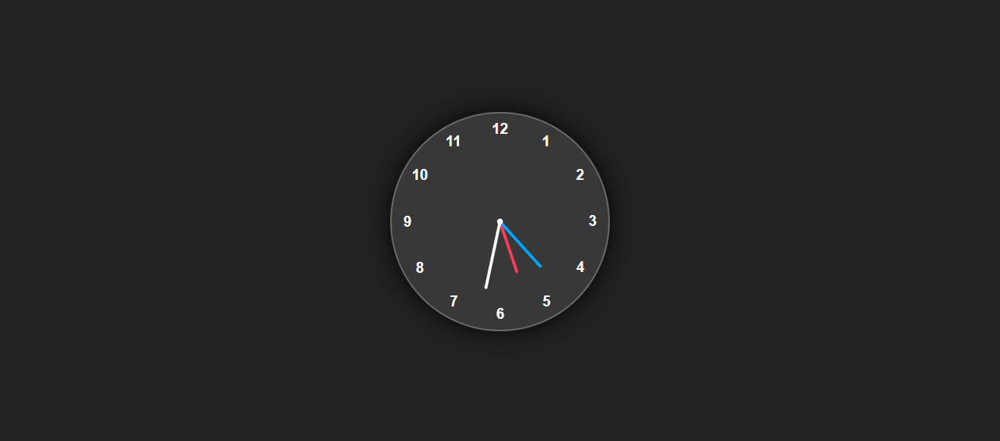

# 🕰️ Analog Clock Web App

A beautifully crafted analog clock built purely with **HTML**, **CSS**, and **JavaScript**. This project demonstrates how to create a functional, real-time analog clock using only frontend technologies.

---

## 📌 Features

- ⏱️ Real-time time update (second, minute, and hour hands)
- 🎨 Stylish and responsive design
- 🧠 Fully functional without any external libraries
- 🖥️ Works on all modern browsers

---

## 🛠️ Tech Stack

- **HTML5** – Structure and layout
- **CSS3** – Styling and animations
- **JavaScript (ES6)** – Time logic and DOM manipulation

---

## 🚀 Live Demo

[👉 Click here to view the live demo](https://your-username.github.io/analog-clock/)  
*(Replace the link after publishing with GitHub Pages)*

---

## 📂 Project Structure

